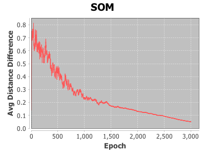

# Self Organizing Map - Spark / Standalone

Reacquainting myself with [Kohonen SOM](https://en.wikipedia.org/wiki/Self-organizing_map) after 20 years.  Check out [this](http://www.ai-junkie.com/ann/som/som1.html) excellent tutorial and the below [references](#references) that I found useful in my rediscovery of SOMs. I never intended this project to be a general purpose library, there are plenty of [those](http://commons.apache.org/proper/commons-math/javadocs/api-3.5/org/apache/commons/math3/ml/neuralnet/sofm/package-summary.html). I learn by explicitly doing. So, the below applications are explicit and concrete implementations of SOM based solutions as standalone [Scala](https://www.scala-lang.org/) and [Spark](http://spark.apache.org/) applications. Along the way, I [stole](http://quoteinvestigator.com/2013/03/06/artists-steal/) code from some of the below [references](#references), to whom I thank profusely.

## Building the Project

The project build is based on [Maven](https://maven.apache.org/):

```
mvn clean package
```

## The Applications

All application accept a configuration file in [HOCON](https://github.com/typesafehub/config/blob/master/HOCON.md) format.

### SOM App

This application is based on [this](http://www.ai-junkie.com/ann/som/som1.html) tutorial.  It organizes an input set of random RGB triplets (or weights) into a 2 dimensional grid, where similar colors are group together into neighboring cells.  The similarity is based on the euclidean distance of the color components .

The following is the `application.conf` file generation:

```
cat << EOF > /tmp/application.conf
numWeights = 1000

numIterations = 2000
alpha = 0.2
somSize = 10

somImageCell = 20
somImagePath = "/tmp/som.png"

errImagePath = "/tmp/err.png"
errImageWidth = 400
errImageHeight = 300
EOF
```

Maven is used to execute the SOM application where it is organizing 1000 (`numWeights`) random RGB colors into a SOM Grid of 10x10 cells (`somSize`). It will train over 2000 (`numIterations`) epochs with a starting learning ratio of 0.2 (`alpha`).

```
mvn -q exec:java\
 -Djava.awt.headless=true\
 -Dconfig.file=/tmp/application.conf\
 -Dexec.mainClass=com.esri.SOMApp
```

At the end of the execution, two files will be generated:
- `/tmp/som.png` is an image of the final color coded grid.
- `/tmp/err.png` is an image of a plot of the training error for each epoch.

/tmp/som.png | /tmp/err.png
----|---
 | 

## Spark App

For a larger input set, we can take advantage of Spark's scheduling of distributed tasks to train the SOM in parallel.

Create a random set of RGB colors using [AWK](https://en.wikipedia.org/wiki/AWK). Note that the color components are between 0.0 and 1.0:

```
cat << EOF > /tmp/rgb.awk
BEGIN{
 OFS=","
 srand()
 for(i=0;i<1000000;i++){
    print rand(),rand(),rand()
 }
}
EOF
awk -f /tmp/rgb.awk > /tmp/rgb.csv
```

Configure the application to use the newly generated `/tmp/rgb.csv` as an input:

```
cat << EOF > /tmp/application.conf
rgbPath = "/tmp/rgb.csv"

numIterations = 200
numPartitions = 8
alpha = 0.2
somSize = 10

somImageCell = 20
somImagePath = "/tmp/som.png"

EOF
```

Submit the job:

```
spark-submit\
 --driver-java-options "-Djava.awt.headless=true -Dconfig.file=/tmp/application.conf"\
 --executor-memory 16G\
 target/spark-som-0.1-jar-with-dependencies.jar
```

The following is a sample output of `/tmp/som.png`:


## TSP App

The final application is solving [TSP](https://en.wikipedia.org/wiki/Travelling_salesman_problem) using SOM. Google it, there is a lot of literature on this.  The attached `TSPApp` is my specific implementation using a 1 dimensional circular network, and uses the [Manhattan](https://en.wikipedia.org/wiki/Taxicab_geometry) distance between the cities as proximity evaluator.

Create a configuration file named `tsp.conf`:

```
cat << EOF > /tmp/tsp.conf
numIterations = 3000
alpha = 0.2

somImagePath = "/tmp/tsp.png"
somImageSize = 400

errImagePath = "/tmp/err.png"
errImageWidth = 400
errImageHeight = 300

numCities = 50
numNodesPerCity = 2

EOF
```

Run the job:

```
mvn -q exec:java\
 -Djava.awt.headless=true\
 -Dconfig.file=/tmp/tsp.conf\
 -Dexec.mainClass=com.esri.TSPApp
```

/tmp/tsp.png | /tmp/err.png
-------------|-------------
 | 

### References

- SOM
    - http://www.ai-junkie.com/ann/som/som1.html
    - http://stackoverflow.com/questions/18233994/interpreting-a-self-organizing-map
    - http://commons.apache.org/proper/commons-math/javadocs/api-3.5/org/apache/commons/math3/ml/neuralnet/sofm/package-summary.html
    - https://oogifu.blogspot.com/2014/07/self-organizing-map-in-scala.html
    - http://mnemstudio.org/neural-networks-kohonen-self-organizing-maps.htm
    - https://github.com/ShokuninSan/som
    - https://www.cs.hmc.edu/~kpang/nn/som.html
    - https://github.com/avr914/SOMLib-Scala.git (Breeze)
    - https://github.com/hvy/tsp-som.git

- Editors and Plotters
    - http://www.mathe-fa.de/en
    - http://www.sciweavers.org/free-online-latex-equation-editor
    - http://knowm.org/open-source/xchart/
    - http://www.sciweavers.org/free-online-latex-equation-editor
    - http://lightning-viz.org/
    - https://github.com/quantifind/wisp
    - https://vega.github.io/vega/

- Utilities
    - https://github.com/a8m/pb-scala
    - https://github.com/ctongfei/progressbar
    - https://github.com/typesafehub/config
    - https://github.com/unicredit/shocon
    - https://github.com/NICTA/rng
    - http://www.easyrgb.com/en/math.php
    - http://pro.arcgis.com/en/pro-app/help/mapping/symbols-and-styles/attribute-driven-symbology.htm
